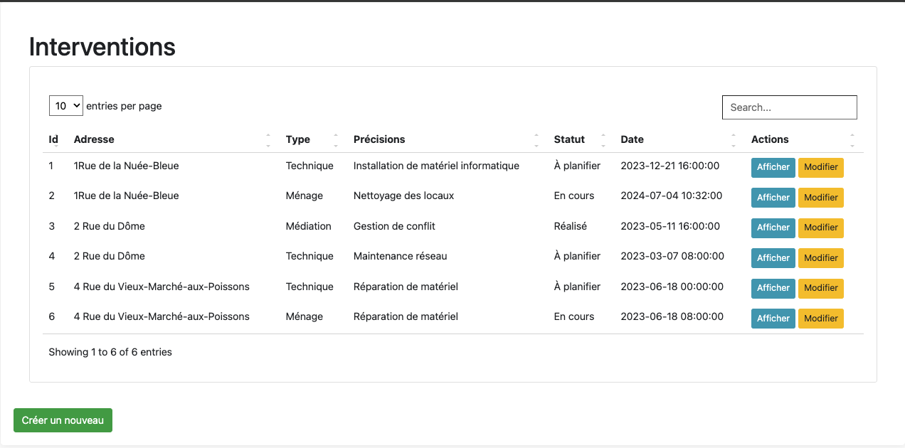

# Projet d'Application Web pour la Gestion des Interventions avec Symfony

## Description
Cette application web légère permet de consulter, modifier, supprimer et ajouter des interventions. Elle affiche les interventions sur une carte interactive où il est possible de mettre à jour leurs statuts. 

L'application est reliée à une base de données hébergée sur un serveur XAMPP local. Vous trouverez l'exportation SQL de la base de données dans le dossier `assets/Bdd/intervention.sql`.

## Fonctionnalités
- **Consultation des interventions :** Afficher toutes les interventions sur une carte interactive.
- **Modification des interventions :** Modifier les détails des interventions existantes.
- **Suppression des interventions :** Supprimer les interventions obsolètes.
- **Ajout de nouvelles interventions :** Ajouter de nouvelles interventions via un formulaire.
- **Mise à jour des statuts :** Éditer les statuts des interventions directement sur la carte.

## Installation
1. Cloner le dépôt sur votre machine locale.
2. Installer XAMPP et démarrer les serveurs Apache et MySQL.
3. Importer la base de données :
    - Ouvrir phpMyAdmin depuis le panneau de contrôle XAMPP.
    - Créer une nouvelle base de données nommée `interventions`.
    - Importer le fichier `assets/Bdd/intervention.sql` dans cette base de données.
4. Configurer les paramètres de connexion à la base de données dans le fichier de configuration de l'application.

## Utilisation
- Lancer l'application depuis votre navigateur en accédant à `http://localhost/GIRAUD-SERVICE-HOTELIER`.
- Utiliser les différentes fonctionnalités via l'interface utilisateur pour gérer les interventions.
## Aperçu

*Interface principale montrant les interventions sur la carte interactive.*

## Répertoires et Fichiers Importants
- `assets/Bdd/intervention.sql` : Fichier SQL pour l'importation de la base de données.

## Auteur
- Ghada benhmida

